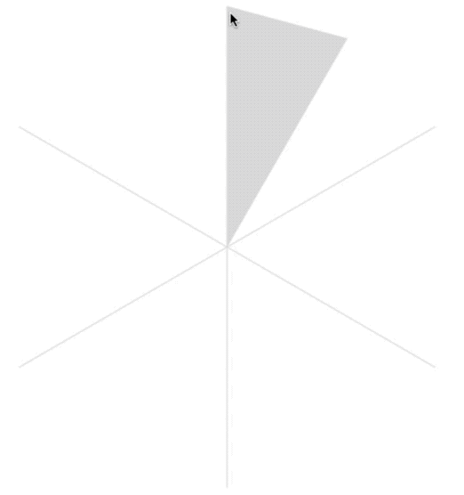
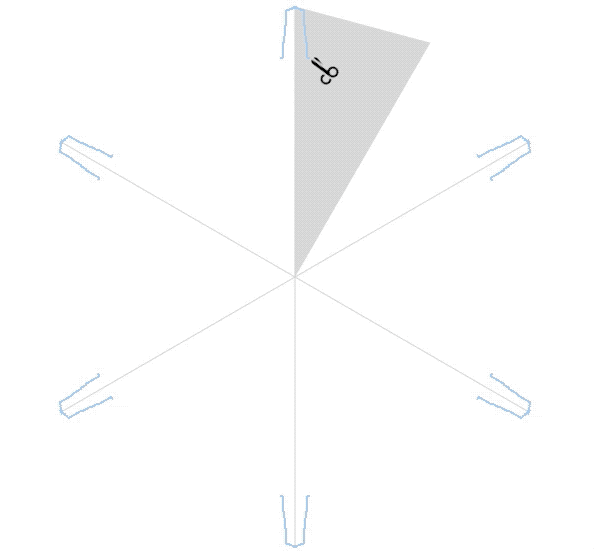
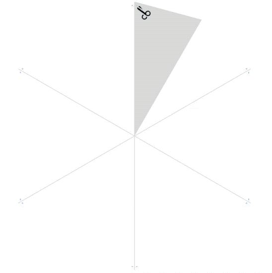

# Paper Snowflake Designer

## What is it?

This demo project uses HTML canvas to draw symmetric, six-pointed snowflakes. You can use it to predict how a design will appear when cut out of paper, or just draw intricate designs that are nice to look at but aren't practical to cut.

I'm not a Javascript pro, so the code isn't pro either :)

## Examples

Impractical to cut, but neat-looking:

## Credits

Some snippets of the Javascript are from various sites and HTML canvas tutorials.

The scissors icon is by (Freepik)[https://www.flaticon.com/authors/freepik] from (www.flaticon.com)[https://www.flaticon.com/free-icon/scissors-cursor_63515]. 
